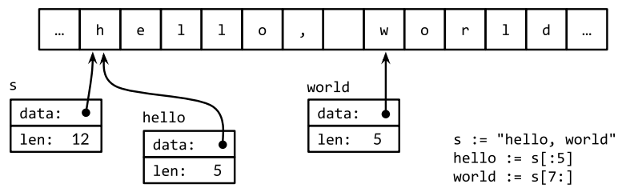

# GOPL CH3  

### 3.4 Bool
true, false 값을 가진다  
다른 언어와 달리 0,1 사용불가  
== 또는 < 같은 비교연산자는 불리언 결과를 생성한다.  
권장사항 x == true 와 같은 중복된표현 지양해야 한다. >> x로 간소화  

```
	if 'a' <= c && c <= 'z' ||
	    'A' <= c && c <= 'Z' ||
	    '0' <= c && c <= '9' {
	    // ...ASCII letter or digit...
	}
```
	
### 3.5 문자열 (stirg)  
텍스트를 담고있는 데이터  
불변의 바이트 시퀀스  
len(문자열) : 문자 갯수가 아닌  바이트 길이 한글(3byte)  
문자열[i:j] : i째 인덱스에서 j번째 인덱까지 일부 바이트를 담는 새 문자열 생성  

  
  
### 3.5.1 문열 리터럴  
큰따옴표 사용가능 "Hllo, 世"  
이스케이프 
```
	  \a: "alert r bell  
	  \b: backspae  
	  \f: form feed  
	  \n: newline  
	  \r: carriage return  
	  \t: tab  
	  \v: vertical tab  
	  \': single qute(only in the rune literal '\'')  
	  \": double quo (only within "..." literals)  
	  \\: backslash  
	  16진 이스케이프 /xhh  
	  8진 이스케이프 000  
	  백쿼트(`) 사 이스케이프 가능  
 ```
### 3.5.2 유니코드
US-ASCII 
전세계 필기 시스템의 문자를 수집  
Go애서 룬(rune) 이라 부르는 표준 숫자를 붙인 유니코드이다  

```
	uint8       the set of all unsigned  8-bit integers (0 to 255)
	uint16      the set of all unsigned 16-bit integers (0 to 65535)
	uint32      the set of all unsigned 32-bit integers (0 to 4294967295)
	uint64      the set of all unsigned 64-bit integers (0 to 18446744073709551615)

	int8        the set of all signed  8-bit integers (-128 to 127)
	int16       the set of all signed 16-bit integers (-32768 to 32767)
	int32       the set of all signed 32-bit integers (-2147483648 to 2147483647)
	int64       the set of all signed 64-bit integers (-9223372036854775808 to 9223372036854775807)

	float32     the set of all IEEE-754 32-bit floating-point numbers
	float64     the set of all IEEE-754 64-bit floating-point numbers

	complex64   the set of all complex numbers with float32 real and imaginary parts
	complex128  the set of all complex numbers with float64 real and imaginary parts

	byte        alias for uint8
	rune        alias for int32 
```

### 3.5.3 UT-8
유니 코드  코드 포인트를 바이트 단위 가변 길이 인코딩이다
1~4바이트
```
	0xxxxxx	rune 					0-127		(ASCII)
	11xxxxx 10xxxxxx				128-2047	(값 <128 미사용)
	110xxxx 10xxxxxx 10xxxxxx			2048−655	(값 <2048 미사용)
	1110xxx 10xxxxxx 10xxxxxx 10xxxxxx		65536−0x10ffff	(다른 값은 사용하지 않음)
	
	\uhhh 16비트값 , Uhhhhhhhh 32비트값
```
문자 길이
```
	unicode/utf8 패키지
	utf8.RuneCountnString(문자열)
	len([]rune(문자열))
```
### 3.5.4 문자열과 바트 슬라이스

문자열조작 주요 표준패키지   
bytes, strings, strconv, unicode   
bytes 패키지 []byte 타입의 이트 슬이스를 조작  
문자열은 불변이기 때문에 점진적인 문열 구축는 다수의 할당 및 복사 연산이 필요  
bytes.Buffer 타입을 사용하것 효율적  
  
### 3.5.5 문자열과 숫자 사이의 변환
정수를 문자열로 변환 2가지 방법
```
  	fmt.Sprintf
	strconv.Itoa("integer to ASCII")
```
```
	x := 123
	y := fmt.Sprintf("%d", x)
	fmt.Println(y, strconv.Itoa(x)) // "123 123"
```
FormatInt와 FormatUint다른 기수 숫자를 포맷 할 수 있다
```
	fmt.Println(strconv.FormatInt(int64(x), 2)) // "1111011"
```

문자열 파싱
```
	x, err := strconv.Atoi("123") // x is an int
	y, err := strconv.ParseInt("123", 10, 64) // base 10, up to 64 bits
```

### 3.6 상수  
상수는 컴파일러가 값을 알고 있으며, 컴파일 시 평가되는 표현식
const 선언, 변수와 유사하지만 명명된 값 실행중 바뀌는 것을 방지
```
	const pi = 3.14159 // math.Pi가 더 정확하다
```

그룹선언 
```
	const (
	    e  = 2.71828
	    pi = 3.14159
	)
```

상수들이 그룹으로 선언되면 첫번째 그룹 외에는 오른쪽 표현식을 생략 가능. 
묵시적 타입 재사용
```
	const (
	    a = 1
	    b
	    c = 2
	    d
	)

	fmt.Println(a, b, c, d) // "1 1 2 2"
```

### 3.6.1 상수 생성기 iota  
const 선언에서 iota 값은 0에서 시작 목록 각항목 마다 1씩 증가
```
	type Weekday int

	const (
	    Sunday Weekday = iota
	    Monday
	    Tuesday
	    Wednesday
	    Thursday
	    Friday
	    Saturday
	)
```

```
	type Flags uint

	const (
	    FlagUp Flags = 1 << iota 
	    FlagBroadcast            
	    FlagLoopback             
	    FlagPointToPoint         
	    FlagMulticast            
	)
````

3.6.2 타입 없는 상수
GO 의 상수는 타입을 지정할수 있지만, 특정타입으로 지정되지 않을수도 있다  
기본타입보다 더 큰 숫자 정밀도로 표현 이런한 상수에 대한 산술 연산은 기계 연산보다 더 정확하다  
최소한 256비트의 정밀도 가정할 수 있다  

math.Pi는 필요한곳 어디든 사용 가능  
```
	var x float32 = math.Pi
	var y float64 = math.Pi
	var z complex128 = math.Pi
```
특정타입 지정시 타입변환 작업필요, 결과가 정확하지 않다
```
	const Pi64 float64 = math.Pi
	var x float32 = float32(Pi64)
	var y float64 = Pi64
	var z complex128 = complex128(Pi64)
```

첫문장에서 변수에 타입이 활당되면  나머지 세문장처럼 묵시적으로 해당변수 타입을 가진다
```
	var f float64 = 3 + 0i // 타입없는 복소수 -> float64
	f = 2                  // 타입없는 정수 -> float64
	f = 1e123              // 타입없는 부동소수점 수 -> float64
	f = 'a'                // 타입없는 룬 -> float64

```
위 문장은 다음과 같다
```
	var f float64 = float64(3 + 0i)
	f = float64(2)
	f = float64(1e123)
	f = float64('a')
```

타입없이 변수 선언시 묵시적 타입 결정

```
	i := 0      // 타입없는 정수;        implicit int(0)
	r := '\000' // 타입없는 룬;           implicit rune('\000')
	f := 0.0    // 타입없는 부동소수점 수; implicit float64(0.0)
	c := 0i     // 타입없는 복소수;        implicit complex128(0i)
```

주의 부동소수 와 복소수 명시적 크기가 지정된 float64와 complex128 로 변환되는 비대치성 주의
